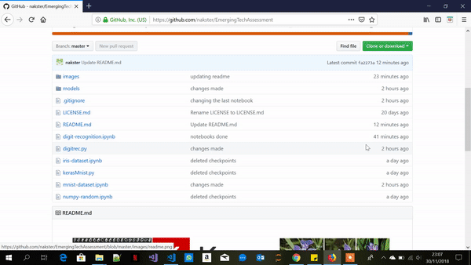
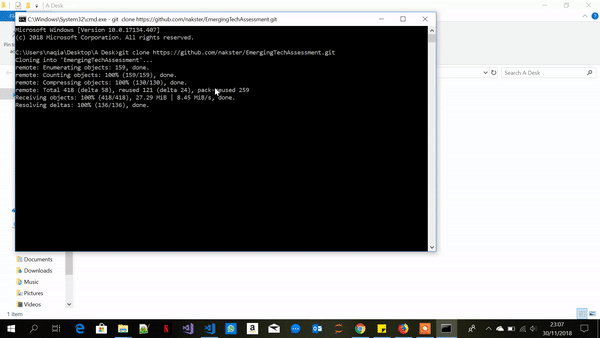

# Emerging Technologies

This github repo contains 4 Jupyter Notebooks and 2 Python Scripts.

1. numpy random notebook: a jupyter notebook explaining the concepts
behind and the use of the numpy random package, including plots
of the various distributions.
2. Iris dataset notebook: a jupyter notebook explaining the famous
iris data set including the difficulty in writing an algorithm to separate
the three classes of iris based on the variables in the dataset.
3. MNIST dataset notebook: a jupyter notebook explaining how to
read the MNIST dataset efficiently into memory in Python.
4. Digit recognition script: a Python script that takes an image file
containing a handwritten digit and identifies the digit using a supervised
learning algorithm and the MNIST dataset. I coded this into two scripts.
5. Digit recognition notebook: a jupyter notebook explaining how the
above Python script works and discussing its performance.

# How to run each of the Notebooks

- First thing we need is to Download [Anaconda](https://www.anaconda.com/download/)
- Clone my github repo or download it to your machine
- run jupyter

- It should automatically bring you to http://localhost:8888/tree/whereeveryourprojectis
- Now you can run the scripts 

